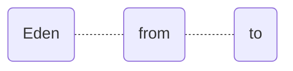

## 1. gc 垃圾回收

垃圾回收的方式：复制算法、标记整理、标记清除、分代回收

垃圾回收的实现：`Serial`、`parNew`、`parallel Scavenge`和`g1d`等等



上面这图是新生代存储和进行垃圾回收的位置，也是Java堆的位置

Java堆中，默认Eden: from: to = 8: 1: 1

### 1.1 目的

- 将转移到老年代的对象数量降低到最小；

- 减少fullGC的执行时间 

### 1.2 问题及解决

- 频繁有大对象在新生代发生复制算法，性能大大降低？

```ruby
-XX:PretenureSizeThreshold=<byte size> # 新生代中的对象进入老年代的大小阈值
```

当对象大小超过设定的字节大小，会直接进入老年代，不接受复制算法的影响

- FGC 太过频繁，怎么解决？
  - 新生代过小，导致对象提前进入老年代，触发老年代发送FGC；
  - 老年代较大，进行GC时耗时较大；

```ruby
-XX:NewRatio=4 # 老年代 与 新生代的 比值，即新生代：老年代 = 4:1 
-XX:SurvivorRatio=4 # Eden 与 一个 Survivor 的比值，即 Eden: Survivor = 4:1
```

- OOM (Out Of MemoryError) 内存溢出错误与SO(Stack OverFlow) 栈溢出？

  - `Xss`设置过小，而每个方法执行需要的局部变量内存太大或者方法嵌套循环次数太高就是出现

  - 存在死循环或者不断重复创建对象，堆实际大小超过了`Xmx`限制

  - 虚拟机装载了太多`Class`和`jar`信息，使得永久代（之前叫方法区）空间不够

理解完后我们去解决

>  Java虚拟机规范 Java 堆的原文：The heap is the runtime data area from which memory for all class instances and arrays is allocated.

我们都知道，每个线程生命周期与虚拟机栈一样，间接说明创建线程的同时也会创建对应的私有虚拟机栈，用于Java方法执行的内存模型

而Java中提供`JVM`调优的三大参数：

用于Java堆（新生代和老年代）

```ruby
-Xms, -Xmx
```

用于永久代

```ruby
-XX:PermSize, -XX:MaxPermSize
```

用于线程栈，不同在于前者可以通过k、m和g来设置，后者要“=数字”，默认以KB（千字节）为单位

```ruby
-Xss, -XX:ThreadStackSize
```

首先先理解堆，堆是`GC`收集器管理的主要区域，这时应该会联想到前文所讲的新生代与老年代，更深入就是`Eden`、`From`和`To`了。

首先先分类，内存溢出有栈溢出和堆溢出，`-Xms`和`-Xms`是设置`Java`堆的初始化大小和可扩展最大值，一般设置成一致，避免发生内存抖动，而`-Xss`则是`Stack Size`的意思，即是每个线程创建虚拟机栈的大小

而且内存受操作系统限制，溢出的问题根源也在这里

```ruby
物理最大内存 = 保留内存 + Xmx（堆） + Xss（栈） * 线程数
Xss = 虚拟机栈宽度（栈帧大小） * 虚拟机栈深度（栈帧数）
栈帧 = 局部变量表 + 操作数栈 + 动态链接 + 方法入口 + 其他
```

内存因为永久代导致的溢出，可以清理应用程序中`web-inf/lib`下的`jar`，或者`tomcat`中启动了多个程序则公用相同的`Jar`

其他内存溢出还有诸如直接内存内存溢出、垃圾回收超时内存溢出、创建本地线程内存溢出、超出交换区内存溢出、数组超限内存溢出、系统杀死进程内存溢出

这些都可以深入去了解

### 1.3 总结

- 尽量固定线程数，也就是通过线程池中固定核心线程执行任务，保证线程占用内存可控，同时需要大量线程时，要优化操作系统的最大可打开连接数；
- 第三方jar包慎重引入，坚决去掉没用的jar包，提高编译的速度和系统的占用内存；
- 递归调用要控制好层级，不要太高超过栈的最大深度（栈的深度受到虚拟机栈和栈帧大小的限制）；
- 分配栈内存并不是越大越好，因为栈内存越大，线程一多，留给堆的空间就不多了，容易抛出`OOM`，一般`JVM`的默认参数是没有问题的（包括递归）。
- 对于大对象或者大量的内存申请，大对象要分片处理，即相当于对持久层数据库的分片处理，提高处理性能，减少对象生命周期

