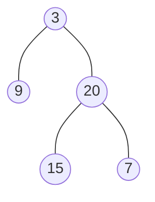

## 1. [144. 二叉树的前序遍历](https://leetcode.cn/problems/binary-tree-preorder-traversal/)

### 问题

给你二叉树的根节点 `root` ，返回它节点值的 **前序** 遍历。

示例1：

```ruby
输入：root = [1,null,2,3]
输出：[1,2,3]
```

示例2：

```ruby
输入：root = []
输出：[]
```

示例3：

```ruby
输入：root = [1]
输出：[1]
```

示例4：

```ruby
输入：root = [1,2]
输出：[1,2]
```

示例5：

```ruby
输入：root = [1,null,2]
输出：[1,2]
```

**提示：**

- 树中节点数目在范围 `[0, 100]` 内
- `-100 <= Node.val <= 100`

### 代码

- 迭代法

```java
class Solution {
    public List<Integer> preorderTraversal(TreeNode root) {
        List<Integer> res = new ArrayList<>();
        Stack<TreeNode> stack = new Stack<>();
        if(root != null)
            stack.push(root);
        while(!stack.empty()) {
            TreeNode cur = stack.pop();
            res.add(cur.val);
            if(cur.right != null) stack.push(cur.right);
            if(cur.left != null) stack.push(cur.left);
        }
        return res;
    }
}
```

- 递归法

```java
class Solution {
    private List<Integer> res = new ArrayList<>();
    public List<Integer> preorderTraversal(TreeNode root) {
        traversal(root);
        return res;
    }
    private void traversal(TreeNode root) {
        if(root == null) {
            return;
        }
        res.add(root.val);
        preorderTraversal(root.left);
        preorderTraversal(root.right);  
    }
}
```

- 统一迭代法

```java
// 空指针来标记 已访问的节点
class Solution {
    public List<Integer> preorderTraversal(TreeNode root) {
        List<Integer> res = new ArrayList<>();
        Stack<TreeNode> stack = new Stack<>();
        if(root == null) {
            return res;
        }
        stack.push(root);
        while(!stack.empty()) {
            TreeNode node = stack.peek();
            if(node != null) {
                stack.pop();
                if(node.right != null) stack.push(node.right);
                if(node.left != null) stack.push(node.left);
                stack.push(node);
                stack.push(null);
            } else {
                stack.pop();
                node = stack.pop();
                res.add(node.val);
            }
        }
        return res;
    }
}
```


## 2. [94. 二叉树的中序遍历](https://leetcode.cn/problems/binary-tree-inorder-traversal/)

### 问题

给定一个二叉树的根节点 `root` ，返回 *它的 **中序** 遍历* 。

示例1：

```ruby
输入：root = [1,null,2,3]
输出：[1,3,2]
```

示例2：

```ruby
输入：root = []
输出：[]
```

示例3：

```ruby
输入：root = [1]
输出：[1]
```

**提示：**

- 树中节点数目在范围 `[0, 100]` 内
- `-100 <= Node.val <= 100`

### 代码

- 迭代法

```java
class Solution {
    public List<Integer> inorderTraversal(TreeNode root) {
        List<Integer> res = new ArrayList<>();
        Stack<TreeNode> stack = new Stack<>();
        TreeNode cur = root;
        // 刚开始 循环 有 cur 来保证，后面由 stack 是否为空 来保证（当然访问中间的时候不需要借助 empty()方法 性能有所提高）
        while(cur != null || !stack.empty()) {
            if(cur != null) {
                stack.push(cur);
                cur = cur.left;
            } else {
                cur = stack.pop();
                res.add(cur.val);
                cur = cur.right;
            }
        }
        return res;
    }
}
```

- 递归法

```java
class Solution {
    private List<Integer> res = new ArrayList<>();
    public List<Integer> inorderTraversal(TreeNode root) {
        traversal(root);
        return res;
    }
    private void traversal(TreeNode root) {
        if(root == null) {
            return;
        }
        traversal(root.left);
        res.add(root.val);
        traversal(root.right);  
    }
}
```

- 统一迭代法

```java
class Solution {
    public List<Integer> inorderTraversal(TreeNode root) {
        List<Integer> res = new ArrayList<>();
        Stack<TreeNode> stack = new Stack<>();
        if(root == null) {
            return res;
        }
        stack.push(root);
        while(!stack.empty()) {
            TreeNode node = stack.peek();
            if(node != null) {
                stack.pop();
                if(node.right != null) stack.push(node.right);
                stack.push(node);
                stack.push(null);
                if(node.left != null) stack.push(node.left);
            } else {
                stack.pop();
                node = stack.pop();
                res.add(node.val);
            }
        }
        return res;
    }
}
```


## 3. [145. 二叉树的后序遍历](https://leetcode.cn/problems/binary-tree-postorder-traversal/)

### 问题

给你一棵二叉树的根节点 `root` ，返回其节点值的 **后序遍历** 。

示例1：

```ruby
输入：root = [1,null,2,3]
输出：[3,2,1]
```

示例2：

```ruby
输入：root = []
输出：[]
```

示例3：

```ruby
输入：root = [1]
输出：[1]
```

**提示：**

- 树中节点的数目在范围 `[0, 100]` 内
- `-100 <= Node.val <= 100`

### 代码

- 迭代法

```java
class Solution {
    public List<Integer> postorderTraversal(TreeNode root) {
        List<Integer> res = new ArrayList<>();
        Stack<TreeNode> stack = new Stack<>();
        if(root != null)
            stack.push(root);
        while(!stack.empty()) {
            TreeNode cur = stack.pop();
            res.add(cur.val);
            if(cur.left != null) stack.push(cur.left);
            if(cur.right != null) stack.push(cur.right);
        }
        Collections.reverse(res);
        return res;
    }
}
```

- 递归法

```java
class Solution {
    private List<Integer> res = new ArrayList<>();
    public List<Integer> postorderTraversal(TreeNode root) {
        traversal(root);
        return res;
    }
    private void traversal(TreeNode root) {
        if(root == null) {
            return;
        }
        traversal(root.left);
        traversal(root.right);  
        res.add(root.val);
    }
}
```

- 统一迭代法

```java
class Solution {
    public List<Integer> postorderTraversal(TreeNode root) {
        List<Integer> res = new ArrayList<>();
        Stack<TreeNode> stack = new Stack<>();
        if(root == null) {
            return res;
        }
        stack.push(root);
        while(!stack.empty()) {
            TreeNode node = stack.peek();
            if(node != null) {
                stack.pop();
                stack.push(node);
                stack.push(null);
                if(node.right != null) stack.push(node.right);
                if(node.left != null) stack.push(node.left);
            } else {
                stack.pop();
                node = stack.pop();
                res.add(node.val);
            }
        }
        return res;
    }
}
```

## 4. [102. 二叉树的层序遍历](https://leetcode.cn/problems/binary-tree-level-order-traversal/)

### 问题

给你二叉树的根节点 `root` ，返回其节点值的 **层序遍历** 。 （即逐层地，从左到右访问所有节点）。

示例1：

```ruby
输入：root = [3,9,20,null,null,15,7]
输出：[[3],[9,20],[15,7]]
```

示例2：

```ruby
输入：root = [1]
输出：[[1]]
```

示例3：

```ruby
输入：root = []
输出：[]
```

**提示：**

- 树中节点数目在范围 `[0, 2000]` 内
- `-1000 <= Node.val <= 1000`

### 代码

```java
class Solution {
    public List<List<Integer>> levelOrder(TreeNode root) {
        List<List<Integer>> res = new ArrayList<>();
        List<Integer> tempList = new ArrayList<>();
        Queue<TreeNode> queue = new LinkedList<>();
        if(root == null) {
            return res;
        }
        queue.offer(root);
        while(!queue.isEmpty()) {
            int size = queue.size();
            while(size-- > 0) {
                TreeNode node = queue.poll();
                tempList.add(node.val);
                if(node.left != null) queue.offer(node.left);
                if(node.right != null) queue.offer(node.right);
            }
            res.add(new ArrayList<>(tempList));
            tempList.clear();
        }
        return res;
    }
}
```

## 5. [226. 翻转二叉树](https://leetcode.cn/problems/invert-binary-tree/)

### 问题

给你一棵二叉树的根节点 `root` ，翻转这棵二叉树，并返回其根节点。

示例1：

```ruby
输入：root = [4,2,7,1,3,6,9]
输出：[4,7,2,9,6,3,1]
```

示例2：

```ruby
输入：root = [2,1,3]
输出：[2,3,1]
```

示例3：

```ruby
输入：root = []
输出：[]
```

### 代码

递归和迭代前序遍历和后序可以实现，但中序只能用迭代，用递归不可以是因为父节点翻转后还去翻转已翻转的子节点，导致有些节点没翻转，有些节点翻转两次

但假中序递归可以实现

```java
invertTree(root->left);         // 左
swap(root->left, root->right);  // 中
invertTree(root->left);         // 注意 这里依然要遍历左孩子，因为中间节点已经翻转了
```

- 递归法

```java
class Solution {
    public TreeNode invertTree(TreeNode root) {
        if(root == null) {
            return root;
        }
        invert(root);
        return root;
    }
    private void invert(TreeNode root) {
        if(root == null) {
            return;
        }
        // 后序遍历的 思想翻转，由下往上
        invert(root.left);
        invert(root.right);
        TreeNode node = root.left;
        root.left = root.right;
        root.right = node;
    }
}
```

- 迭代法

```java
// 前序遍历 从上往下 翻转
class Solution {
    public TreeNode invertTree(TreeNode root) {
        Stack<TreeNode> stack = new Stack<>();
        if(root == null) {
            return root;
        }
        stack.push(root);
        while(!stack.empty()) {
            TreeNode node = stack.pop();
            TreeNode tempNode = node.left;
            node.left = node.right;
            node.right = tempNode;
            if(node.right != null) stack.push(node.right);
            if(node.left != null) stack.push(node.left);

        }
        return root;
    }
}
```

## 6. [101. 对称二叉树](https://leetcode.cn/problems/symmetric-tree/)

### 问题

给你一个二叉树的根节点 `root` ， 检查它是否轴对称。

示例1：

```ruby
输入：root = [1,2,2,3,4,4,3]
输出：true
```

示例2：

```ruby
输入：root = [1,2,2,null,3,null,3] 
输出：false
```

**提示：**

- 树中节点数目在范围 `[1, 1000]` 内
- `-100 <= Node.val <= 100`

### 代码

- 递归法

```java
class Solution {
    public boolean isSymmetric(TreeNode root) {
        return compare(root.left, root.right);
        
    }
    private boolean compare(TreeNode left, TreeNode right) {
        if(left == null && right != null) {
            return false;
        } else if(left != null && right == null) {
            return false;
        } else if(left == null && right == null) {
            return true;
        } else if(left.val != right.val) {
            return false;
        }
        boolean outside = compare(left.left, right.right);
        boolean inside = compare(left.right, right.left);
        boolean isSame = outside && inside;
        return isSame;
    }
} 
```

- 迭代法

```java
class Solution {
    public boolean isSymmetric(TreeNode root) {
        Queue<TreeNode> queue = new LinkedList<>();
        if(root == null) {
            return true;
        }
        queue.offer(root.left);
        queue.offer(root.right);
        while(!queue.isEmpty()) {
            TreeNode leftNode = queue.poll();
            TreeNode rightNode = queue.poll();
            // leftNode 和 rightNode 都为空
            if(leftNode == null && rightNode == null) {
                continue;
            }
            // leftNode 和 rightNode 有一个 为空，否则两个都不为空时，两者下标的 值不同
            if(leftNode == null || rightNode == null || leftNode.val != rightNode.val) {
                return false;
            }
            queue.offer(leftNode.left);
            queue.offer(rightNode.right);
            queue.offer(leftNode.right);
            queue.offer(rightNode.left);
        }
        return true;
    }
}
```

## 7. [104. 二叉树的最大深度](https://leetcode.cn/problems/maximum-depth-of-binary-tree/)

### 问题

给定一个二叉树，找出其最大深度。

二叉树的深度为根节点到最远叶子节点的最长路径上的节点数。

**说明:** 叶子节点是指没有子节点的节点。

示例：

给定二叉树 `[3,9,20,null,null,15,7]`，



返回它的最大深度 3 。

### 代码

- 前序遍历回溯法

```java
class Solution {
    private Integer res = 0;
    public int maxDepth(TreeNode root) {
        if(root == null) return 0;
        getDepth(root, 1);
        return res;
    }
    private void getDepth(TreeNode root, Integer depth) {
        res = depth > res ? depth : res;
        if(root.left != null) {
            depth++;
            getDepth(root.left, depth);
            depth--; // 回溯
        }
        if(root.right != null) {
            depth++;
            getDepth(root.right, depth);
            depth--; // 回溯
        }
        return;
    }
}
```

简化代码

```java
class Solution {
    private Integer res = 0;
    public int maxDepth(TreeNode root) {
        if(root == null) return 0;
        getDepth(root, 1);
        return res;
    }
    private void getDepth(TreeNode root, Integer depth) {
        res = depth > res ? depth : res;
        if(root.left != null) 
            getDepth(root.left, depth + 1);
        if(root.right != null) 
            getDepth(root.right, depth + 1);
        return;
    }
}
```


- 后序遍历递归法

```java
class Solution {
    public int maxDepth(TreeNode root) {
        return getDepth(root);
    }

    private int getDepth(TreeNode root) {
        if(root == null) {
            return 0;
        }
        int leftDepth = getDepth(root.left);
        int rightDepth = getDepth(root.right);
        return 1 + Math.max(leftDepth, rightDepth);
    }
}
```

## 8. [111. 二叉树的最小深度](https://leetcode.cn/problems/minimum-depth-of-binary-tree/)

### 问题

给定一个二叉树，找出其最小深度。

最小深度是从根节点到最近叶子节点的最短路径上的节点数量。

**说明：**叶子节点是指没有子节点的节点。

示例1：

```ruby
输入：root = [3,9,20,null,null,15,7]
输出：2
```

示例2：

```ruby
输入：root = [2,null,3,null,4,null,5,null,6]
输出：5
```

**提示：**

- 树中节点数的范围在 `[0, 105]` 内
- `-1000 <= Node.val <= 1000`

### 代码 

```java
class Solution {
    public int minDepth(TreeNode root) {
        return getDepth(root);
    }
    private int getDepth(TreeNode root) {
        if(root == null) {
            return 0;
        }
        int leftDepth = getDepth(root.left);
        int rightDepth = getDepth(root.right);
        if(root.left == null && root.right != null) {
            return 1 + rightDepth;
        }
        if(root.left != null && root.right == null) {
            return 1 + leftDepth;
        }
        return 1 + Math.min(leftDepth, rightDepth);
    }
}
```

## 9. [222. 完全二叉树的节点个数](https://leetcode.cn/problems/count-complete-tree-nodes/)

### 问题

给你一棵 完全二叉树 的根节点 root ，求出该树的节点个数。

完全二叉树 的定义如下：在完全二叉树中，除了最底层节点可能没填满外，其余每层节点数都达到最大值，并且最下面一层的节点都集中在该层最左边的若干位置。若最底层为第 h 层，则该层包含 1~ 2h 个节点。

示例1：

```ruby
输入：root = [1,2,3,4,5,6]
输出：6
```

示例2：

```ruby
输入：root = []
输出：0
```

示例3：

```ruby
输入：root = [1]
输出：1
```

**提示：**

- 树中节点的数目范围是`[0, 5 * 104]`
- `0 <= Node.val <= 5 * 104`
- 题目数据保证输入的树是 **完全二叉树**

### 代码

- 层次遍历迭代法

```java
 // 根据完全二叉树的特性，使用层序遍历解决
class Solution {
    public int countNodes(TreeNode root) {
        Queue<TreeNode> queue = new LinkedList<>();
        if(root == null) {
            return 0;
        }
        int nodeCount = 0;
        queue.offer(root);
        while(!queue.isEmpty()) {
            nodeCount++;
            TreeNode node = queue.poll();
            if(node.left != null) queue.offer(node.left);
            if(node.right != null) queue.offer(node.right);
        }
        return nodeCount;
    }
}
```

- 后序遍历递归法

```java
 // 普通二叉树 递归 后序遍历
class Solution {
    public int countNodes(TreeNode root) {
        return getNoeCounts(root);
    }
    private int getNoeCounts(TreeNode node) {
        if(node == null) {
            return 0;
        }
        int leftNodeCounts = getNoeCounts(node.left);
        int rightNodeCounts = getNoeCounts(node.right);
        return leftNodeCounts + rightNodeCounts + 1;
    }
}
```

## 10. [110. 平衡二叉树](https://leetcode.cn/problems/balanced-binary-tree/)

### 问题

给定一个二叉树，判断它是否是高度平衡的二叉树。

本题中，一棵高度平衡二叉树定义为：

> 一个二叉树*每个节点* 的左右两个子树的高度差的绝对值不超过 1 。

示例1：

```ruby
输入：root = [3,9,20,null,null,15,7]
输出：true
```

示例2：

```ruby
输入：root = [1,2,2,3,3,null,null,4,4]
输出：false
```

示例3：

```ruby
输入：root = []
输出：true
```

**提示：**

- 树中的节点数在范围 `[0, 5000]` 内
- `-104 <= Node.val <= 104`

### 代码

后序遍历递归法

```java
 // 每个节点 的左右两个子树的高度差的绝对值不超过 1
class Solution {
    public boolean isBalanced(TreeNode root) {
        if(root == null) {
            return true;
        }
        return NodeHeigh(root) == -1 ? false : true;
    }
    // 递归尝试 找到一处 高度差 为 > 1,如有 停止 计算高度，直接 由内到外返回 结果
    private int NodeHeigh(TreeNode node) {
        if(node == null) {
            return 0;
        }
        int leftHeigh = NodeHeigh(node.left);
        int rightHeigh = NodeHeigh(node.right);
        if(leftHeigh == -1 || rightHeigh == -1) return -1;
        int heigh = Math.max(leftHeigh, rightHeigh) + 1;
        return Math.abs(leftHeigh - rightHeigh) > 1 ? -1 : heigh;
    }
}
```

前序遍历迭代法

```java
 // 每个节点 的左右两个子树的高度差的绝对值不超过 1
// 前序 遍历 求 深度
class Solution {
    public boolean isBalanced(TreeNode root) {
        Stack<TreeNode> stack = new Stack<>();
        if(root == null) {
            return true;
        }
        stack.push(root);
        while(!stack.empty()) {
            TreeNode node = stack.pop();
            // 获取 两棵 子树 的高度差
            if(Math.abs(getDepth(node.left) - getDepth(node.right)) > 1) {
                return false;
            }
            // 大子树 不超过，遍历 小子树
            if(node.right != null) stack.push(node.right);
            if(node.left != null) stack.push(node.left);
        }
        return true;
    }
    // 准确来说 计算的是 节点的高度（该节点到叶子结点）
    // 后序 遍历 求 高度
    private int getDepth(TreeNode root) {
        Integer depth = 0;
        Integer res = 0;
        Stack<TreeNode> stack = new Stack<>();
        if(root == null) {
            return 0;
        }
        stack.push(root);
        while(!stack.empty()) {
            // 栈存放了 空指针
            TreeNode node = stack.peek();
            if(node != null) {
                node = stack.pop();
                stack.push(node);
                stack.push(null);
                depth++;
                if(node.right != null) stack.push(node.right);
                if(node.left != null) stack.push(node.left);
            } else {
                // 弹出 空指针
                stack.pop();
                node = stack.pop();
                depth--; // 类似 回溯
            }
        res = depth > res ? depth : res;
        }
        return res;
    } 
}
```

## 11. [257. 二叉树的所有路径](https://leetcode.cn/problems/binary-tree-paths/)

给你一个二叉树的根节点 `root` ，按 **任意顺序** ，返回所有从根节点到叶子节点的路径。

**叶子节点** 是指没有子节点的节点。

示例1:

```ruby
输入：root = [1,2,3,null,5]
输出：["1->2->5","1->3"]
```

实例2：

```ruby
输入：root = [1]
输出：["1"]
```

**提示：**

- 树中节点的数目在范围 `[1, 100]` 内
- `-100 <= Node.val <= 100`

### 代码

- 递归法

```java
class Solution {
    public List<String> binaryTreePaths(TreeNode root) {
        List<String> res = new ArrayList<>();
        if(root == null) {
            return res;
        }
        backtrack(root, res, "");
        return res;
    }
    // 前序递归遍历 所有节点
    private void backtrack(TreeNode cur,List<String> res, String path) {
        // 不是空节点 加上
        path += cur.val;
        // 找到 叶子节点
        if(cur.left == null && cur.right == null) {
            res.add(path);
            return;
        }
        if(cur.left != null) backtrack(cur.left, res, path + "->");
        // 隐藏了 回溯，path 是 String 类型，不可变类
        if(cur.right != null) backtrack(cur.right, res, path + "->");
    }
}
```

- 迭代法

```java
class Solution {
    public List<String> binaryTreePaths(TreeNode root) {
        List<String> res = new ArrayList<>();
        if(root == null) {
            return res;
        }
        Stack<String> pathSt = new Stack<>();
        Stack<TreeNode> stack = new Stack<>();
        pathSt.push(root.val + "");
        stack.push(root);
        while(!stack.empty()) {
            TreeNode node = stack.pop();
            String path = pathSt.pop();
            if(node.left == null && node.right == null) {
                res.add(path);
            }
            if(node.right != null) {
                pathSt.push(path + "->" + node.right.val);
                stack.push(node.right);
            }           
            if(node.left != null) {
                pathSt.push(path + "->" + node.left.val);
                stack.push(node.left);
            } 
        }
        return res;
    }
}
```

## 12. [100. 相同的树](https://leetcode.cn/problems/same-tree/)

### 问题

给你两棵二叉树的根节点 `p` 和 `q` ，编写一个函数来检验这两棵树是否相同。

如果两个树在结构上相同，并且节点具有相同的值，则认为它们是相同的。

示例1：

```ruby
输入：p = [1,2,3], q = [1,2,3]
输出：true
```

示例2：

```ruby
输入：p = [1,2], q = [1,null,2]
输出：false
```

示例3：

```ruby
输入：p = [1,2,1], q = [1,1,2]
输出：false
```

**提示：**

- 两棵树上的节点数目都在范围 `[0, 100]` 内
- `-104 <= Node.val <= 104`

### 代码

- 递归法

```java
 // 前序递归遍历
class Solution {
    public boolean isSameTree(TreeNode p, TreeNode q) {
        if(p == null && q == null) return true;
        else if(p == null && q != null) return false;
        else if(p != null && q == null) return false;
        else if(p.val != q.val) return false;
 
        boolean leftTreeSame = isSameTree(p.left, q.left);
        boolean rightTreeSame = isSameTree(p.right, q.right);
        boolean isSame = leftTreeSame && rightTreeSame;
        return isSame;
    }
}
```

- 迭代法

```java
 // 层序迭代遍历
class Solution {
    public boolean isSameTree(TreeNode p, TreeNode q) {
        if(p == null && q == null) return true;
        if(p == null || q == null) return false;
        // p 和 q 都不等于 null
        Stack<TreeNode> stack = new Stack<>();
        stack.push(p);
        stack.push(q);
        while(!stack.empty()) {
            TreeNode leftNode = stack.pop();
            TreeNode rightNode = stack.pop();            
            if(leftNode == null && rightNode == null) continue;
            if(leftNode == null || rightNode == null || leftNode.val != rightNode.val) {
                return false;
            }
            // leftNode 和 rightNode 都不为 null
            stack.push(leftNode.left);
            stack.push(rightNode.left);
            stack.push(leftNode.right);
            stack.push(rightNode.right);
        }
        return true;
    }
}
```

## 13. [112. 路径总和](https://leetcode.cn/problems/path-sum/)

### 问题

给你二叉树的根节点 root 和一个表示目标和的整数 targetSum 。判断该树中是否存在 根节点到叶子节点 的路径，这条路径上所有节点值相加等于目标和 targetSum 。如果存在，返回 true ；否则，返回 false 。

叶子节点 是指没有子节点的节点。

示例1：

```ruby
输入：root = [5,4,8,11,null,13,4,7,2,null,null,null,1], targetSum = 22
输出：true
解释：等于目标和的根节点到叶节点路径如上图所示。
```

示例2：

```ruby
输入：root = [1,2,3], targetSum = 5
输出：false
解释：树中存在两条根节点到叶子节点的路径：
(1 --> 2): 和为 3
(1 --> 3): 和为 4
不存在 sum = 5 的根节点到叶子节点的路径。
```

示例3：

```ruby
输入：root = [], targetSum = 0
输出：false
解释：由于树是空的，所以不存在根节点到叶子节点的路径。
```

**提示：**

- 树中节点的数目在范围 `[0, 5000]` 内

- `1000 <= Node.val <= 1000`

- `1000 <= targetSum <= 1000`

### 代码

- 前序遍历递归法

```java
class Solution {
    boolean res = false;
    public boolean hasPathSum(TreeNode root, int targetSum) {
        if(root == null) {
            return false;
        }
        backtrack(root, targetSum, root.val);
        return res;
    }
    private void backtrack(TreeNode node, int targetSum, int sum) {   
        if(node.left == null && node.right == null && sum == targetSum) {
            res = true;
        }
        if(node.left != null) backtrack(node.left, targetSum, sum + node.left.val);
        if(node.right != null) backtrack(node.right, targetSum, sum + node.right.val);
    }
}
```

- 前序遍历迭代法

```java
class Solution {
    boolean res = false;
    public boolean hasPathSum(TreeNode root, int targetSum) {
        if(root == null) {
            return false;
        }
        Stack<TreeNode> tNst = new Stack<>();
        Stack<Integer> valSt = new Stack<>();
        tNst.push(root);
        valSt.push(root.val);
        while(!tNst.empty()) {
            TreeNode node = tNst.pop();
            int sum = valSt.pop();
            if(node.left == null && node.right == null && sum == targetSum) {
                return true;
            }
            if(node.left != null) {
                valSt.push(sum + node.left.val);
                tNst.push(node.left);
            }            
            if(node.right != null) {
                valSt.push(sum + node.right.val);
                tNst.push(node.right);
            }         
        }
        return false;
    }
}
```

## 14. [106. 从中序与后序遍历序列构造二叉树](https://leetcode.cn/problems/construct-binary-tree-from-inorder-and-postorder-traversal/)

### 问题

给定两个整数数组 `inorder` 和 `postorder` ，其中 `inorder` 是二叉树的中序遍历， `postorder` 是同一棵树的后序遍历，请你构造并返回这颗 二叉树 。

示例1：

```ruby
输入：inorder = [9,3,15,20,7], postorder = [9,15,7,20,3]
输出：[3,9,20,null,null,15,7]
```

示例2：

```ruby
输入：inorder = [-1], postorder = [-1]
输出：[-1]
```

**提示:**

- `1 <= inorder.length <= 3000`
- `postorder.length == inorder.length`
- `-3000 <= inorder[i], postorder[i] <= 3000`
- `inorder` 和 `postorder` 都由 不同 的值组成
- `postorder` 中每一个值都在 `inorder` 中
- `inorder` 保证是树的中序遍历
- `postorder` 保证是树的后序遍历

### 代码

- 前序遍历递归法 ( DFS 写法 )

```java
class Solution {
    public TreeNode buildTree(int[] inorder, int[] postorder) {
        return backtrack(inorder, 0, inorder.length, postorder, 0, postorder.length);
    }
    // 左闭右开区间
    private TreeNode backtrack(int[] inorder, int inLeft, int inRight, int[] postorder, int postLeft, int postRight) {
        int index = inLeft;
        if(inLeft == inRight) return null;
        TreeNode root = new TreeNode(postorder[postRight - 1]);
        // 所以for 循环 终止条件是 < 符合
        for(int i = inLeft; i < inRight; i++) {
            if(inorder[i] == postorder[postRight - 1]) {
                index = i;
                break;
            }
        }
        // 找的是 左区间，也就是 左节点
        root.left = backtrack(inorder, inLeft, index, postorder, postLeft, postLeft + (index - inLeft));
        // 找的是 右区间，也就是 右节点
        root.right = backtrack(inorder, index + 1, inRight, postorder, postLeft + (index - inLeft), postRight - 1);
        return root;
    }
}
```

## 15. [105. 从前序与中序遍历序列构造二叉树](https://leetcode.cn/problems/construct-binary-tree-from-preorder-and-inorder-traversal/)

### 问题

给定两个整数数组 preorder 和 inorder ，其中 preorder 是二叉树的先序遍历， inorder 是同一棵树的中序遍历，请构造二叉树并返回其根节点。

示例1：

```ruby
输入: preorder = [3,9,20,15,7], inorder = [9,3,15,20,7]
输出: [3,9,20,null,null,15,7]
```

示例2：

```ruby
输入: preorder = [-1], inorder = [-1]
输出: [-1]
```

**提示:**	

- 1 `<= preorder.length <= 3000`
- `inorder.length == preorder.length`
  - `-3000 <= preorder[i], inorder[i] <= 3000`
- `preorder` 和 `inorder` 均 无重复 元素
- `inorder` 均出现在 `preorder`
- `preorder` 保证 为二叉树的前序遍历序列
- `inorder` 保证 为二叉树的中序遍历序列

### 代码

- `DFS` 递归法

```java
class Solution {
    public TreeNode buildTree(int[] preorder, int[] inorder) {
        return backtrack(preorder, 0, preorder.length, inorder, 0, inorder.length);
    }
    private TreeNode backtrack(int[] preorder, int preLeft, int preRight, int[] inorder, int inLeft, int inRight) {   
        if(inLeft == inRight) return null;
        TreeNode root = new TreeNode(preorder[preLeft]);  
        int index = inLeft;
        for(int i = inLeft; i < inRight; i++) {
            if(inorder[i] == preorder[preLeft]) {
                index = i;
                break;
            }
        }
        root.left = backtrack(preorder, preLeft + 1, preLeft + 1 + (index - inLeft), inorder, inLeft, index);
        root.right = backtrack(preorder, preLeft + 1 + (index - inLeft), preRight, inorder, index + 1, inRight);
        return root;
    }
}
```

## 16. [654. 最大二叉树](https://leetcode.cn/problems/maximum-binary-tree/)

### 问题

给定一个不重复的整数数组 `nums` 。 最大二叉树 可以用下面的算法从 `nums` 递归地构建:

创建一个根节点，其值为 `nums` 中的最大值。
递归地在最大值 左边 的 子数组前缀上 构建左子树。
递归地在最大值 右边 的 子数组后缀上 构建右子树。
返回 `nums` 构建的 最大二叉树 。	

示例1：

```java
输入：nums = [3,2,1,6,0,5]
输出：[6,3,5,null,2,0,null,null,1]
解释：递归调用如下所示：
- [3,2,1,6,0,5] 中的最大值是 6 ，左边部分是 [3,2,1] ，右边部分是 [0,5] 。
    - [3,2,1] 中的最大值是 3 ，左边部分是 [] ，右边部分是 [2,1] 。
        - 空数组，无子节点。
        - [2,1] 中的最大值是 2 ，左边部分是 [] ，右边部分是 [1] 。
            - 空数组，无子节点。
            - 只有一个元素，所以子节点是一个值为 1 的节点。
    - [0,5] 中的最大值是 5 ，左边部分是 [0] ，右边部分是 [] 。
        - 只有一个元素，所以子节点是一个值为 0 的节点。
        - 空数组，无子节点。
```

示例2：

```ruby
输入：nums = [3,2,1]
输出：[3,null,2,null,1]
```

**提示：**

- `1 <= nums.length <= 1000`
- `0 <= nums[i] <= 1000`
- `nums` 中的所有整数 **互不相同**

### 代码

```java
class Solution {
    public TreeNode constructMaximumBinaryTree(int[] nums) {
        return recursion(nums, 0, nums.length);
    }
    private TreeNode recursion(int[] nums, int leftIndex, int rightIndex) {
        if(leftIndex == rightIndex) {
            return null;
        }
        int maxIndex = leftIndex;
        int max = nums[maxIndex];
        for(int i = leftIndex; i < rightIndex; i++) {
            if(max < nums[i]) {
                max = nums[i];
                maxIndex = i;
            }
        }
        TreeNode root = new TreeNode(max);
        root.left = recursion(nums, leftIndex, maxIndex);
        root.right = recursion(nums, maxIndex + 1, rightIndex);
        return root;
    }
}
```

### 小总结

涉及到使用数组递归创建二叉树可以使用以下模板

```java
class Solution {
    public TreeNode constructMaximumBinaryTree(int[] nums) {
        return recursion(nums, 0, nums.length, ...);
    }
    private TreeNode recursion(int[] nums, int leftIndex, int rightIndex, ...) {
        if(leftIndex == rightIndex) {
            return null;
        }
        // 初始化 要创建的节点坐标
        int rootIndex = 0;
        for(int i = leftIndex; i < rightIndex; i++) {
            // 满足创建节点条件
            // rootIndex = ?
        }
        TreeNode root = new TreeNode(nums[rootIndex]);
        root.left = recursion(nums, leftIndex, maxIndex, ...);
        root.right = recursion(nums, maxIndex + 1, rightIndex, ...);
        return root;
    }
}
```

## 17. [617. 合并二叉树](https://leetcode.cn/problems/merge-two-binary-trees/)

### 问题

给你两棵二叉树： root1 和 root2 。

想象一下，当你将其中一棵覆盖到另一棵之上时，两棵树上的一些节点将会重叠（而另一些不会）。你需要将这两棵树合并成一棵新二叉树。合并的规则是：如果两个节点重叠，那么将这两个节点的值相加作为合并后节点的新值；否则，不为 null 的节点将直接作为新二叉树的节点。

返回合并后的二叉树。

注意: 合并过程必须从两个树的根节点开始。

示例1：

```ruby
输入：root1 = [1,3,2,5], root2 = [2,1,3,null,4,null,7]
输出：[3,4,5,5,4,null,7]
```

示例2：

```ruby
输入：root1 = [1], root2 = [1,2]
输出：[2,2]
```

**提示：**

- 两棵树中的节点数目在范围 `[0, 2000]` 内
- `-104 <= Node.val <= 104`

### 代码

- 前序遍历递归法

```java
class Solution {
    public TreeNode mergeTrees(TreeNode root1, TreeNode root2) {
        if(root1 == null) return root2;
        if(root2 == null) return root1;
        root1.val += root2.val;
        root1.left = mergeTrees(root1.left, root2.left);
        root1.right = mergeTrees(root1.right, root2.right);
        return root1;
    }
}
```

- 层序遍历迭代法

```java
class Solution {
    public TreeNode mergeTrees(TreeNode root1, TreeNode root2) {
        if(root1 == null) return root2;
        if(root2 == null) return root1;
        Stack<TreeNode> stack = new Stack<>();
        stack.push(root2);
        stack.push(root1);
        while(!stack.empty()) {
            TreeNode node1 = stack.pop();
            TreeNode node2 = stack.pop();
            node1.val += node2.val;
            if(node1.left != null && node2.left != null) {
                stack.push(node2.left);
                stack.push(node1.left);
            }
            if(node1.right != null && node2.right != null) {
                stack.push(node2.right);
                stack.push(node1.right);
            }
            // 这里 赋值的 是 node2 的子树（子树！）
            if(node1.left == null && node2.left != null) {
                node1.left = node2.left;
            }
            if(node1.right == null && node2.right != null) {
                node1.right = node2.right;
            }
        }
        return root1;
    }
}
```

## 18. [700. 二叉搜索树中的搜索](https://leetcode.cn/problems/search-in-a-binary-search-tree/)

### 问题

给定二叉搜索树（BST）的根节点 root 和一个整数值 val。

你需要在 BST 中找到节点值等于 val 的节点。 返回以该节点为根的子树。 如果节点不存在，则返回 null 。

示例1：

```ruby
输入：root = [4,2,7,1,3], val = 2
输出：[2,1,3]
```

示例2：

```ruby
输入：root = [4,2,7,1,3], val = 5
输出：[]
```

**提示：**

- 数中节点数在 `[1, 5000]` 范围内
- `1 <= Node.val <= 107`
- `root` 是二叉搜索树
- `1 <= val <= 107`

### 代码

- 前序遍历递归法


```java
class Solution {
    private TreeNode res = null;
    public TreeNode searchBST(TreeNode root, int val) {
        search(root, val);
        return res;
    }
    private void search(TreeNode root, int val) {
        if(root.val == val) {
            res = root;
            return;
        }
        if(root.left != null) search(root.left, val);
        if(root.right != null) search(root.right, val);
    }
}
```

## 19. [700. 二叉搜索树中的搜索](https://leetcode.cn/problems/search-in-a-binary-search-tree/)

### 问题

给定二叉搜索树（BST）的根节点 root 和一个整数值 val。

你需要在 BST 中找到节点值等于 val 的节点。 返回以该节点为根的子树。 如果节点不存在，则返回 null 。

示例1：

```ruby
输入：root = [4,2,7,1,3], val = 2
输出：[2,1,3]
```

示例2：

```ruby
输入：root = [4,2,7,1,3], val = 5
输出：[]
```

**提示：**

- 数中节点数在 `[1, 5000]` 范围内
- `1 <= Node.val <= 107`
- `root` 是二叉搜索树
- `1 <= val <= 107`

### 代码

```java
class Solution {
    public TreeNode searchBST(TreeNode root, int val) {
        Stack<TreeNode> stack = new Stack<>();
        stack.push(root);
        while(!stack.empty()) {
            TreeNode node = stack.pop();
            if(node.val == val) {
                return node;
            }
            if(node.right != null) stack.push(node.right);
            if(node.left != null) stack.push(node.left);
        }
        return null;
    }
}
```

## 20. [98. 验证二叉搜索树](https://leetcode.cn/problems/validate-binary-search-tree/)

### 问题

给你一个二叉树的根节点 root ，判断其是否是一个有效的二叉搜索树。

有效 二叉搜索树定义如下：

节点的左子树只包含 小于 当前节点的数。
节点的右子树只包含 大于 当前节点的数。
所有左子树和右子树自身必须也是二叉搜索树。

示例1：

```ruby
输入：root = [2,1,3]
输出：true
```

示例2：

```ruby
输入：root = [5,1,4,null,null,3,6]
输出：false
解释：根节点的值是 5 ，但是右子节点的值是 4 。
```

**提示：**

- 树中节点数目范围在`[1, 104]` 内
- `-231 <= Node.val <= 231 - 1`

### 代码

- 中序遍历递归法

```java
 // 注意 保存上一个值来比较，初始化要小于 int 类型最小值
class Solution {
    private long preVal = ((long)Integer.MIN_VALUE - 1);
    private boolean isTrue = true;
    public boolean isValidBST(TreeNode root) {
        recursion(root);
        return isTrue;    
    }
    private void recursion(TreeNode node) {
        if(node == null) return;
        if(node.left != null && isTrue) recursion(node.left);
        if(node.val <= preVal) {
            isTrue = false;
            return;
        }
        preVal = node.val;
        if(node.right != null & isTrue) recursion(node.right);  
    }
}
```

- 中序遍历迭代法

```java
class Solution {
    public boolean isValidBST(TreeNode root) {
        long preVal = ((long)Integer.MIN_VALUE - 1);
        Stack<TreeNode> stack = new Stack<>();
        stack.push(root);
        while(!stack.empty()) {
            TreeNode node = stack.peek();
            if(node != null) {
                stack.pop();
                if(node.right != null) stack.push(node.right);     
                stack.push(node);
                stack.push(null);
                if(node.left != null) stack.push(node.left);
            } else {
                stack.pop();
                node = stack.pop();
                if(node.val <= preVal) {
                    return false;
                }
                preVal = node.val;
            }
        }
        return true;
    }
}
```

## 21. [530. 二叉搜索树的最小绝对差](https://leetcode.cn/problems/minimum-absolute-difference-in-bst/)

### 问题

给你一个二叉搜索树的根节点 `root` ，返回 **树中任意两不同节点值之间的最小差值** 。

差值是一个正数，其数值等于两值之差的绝对值。

示例1：

```ruby
输入：root = [4,2,6,1,3]
输出：1
```

示例2：

```ruby
输入：root = [1,0,48,null,null,12,49]
输出：1
```

**提示：**

- 树中节点的数目范围是 `[2, 104]`
- `0 <= Node.val <= 105`

### 代码

- 中序遍历递归法

```java
 // 中序遍历，保存前一元素变量和当前最新差变量
class Solution {
    private int diffVal = Integer.MAX_VALUE;
    private int preVal = - 100000;
    public int getMinimumDifference(TreeNode root) {
        recursion(root);
        return diffVal;
    }
    private void recursion(TreeNode node) {
        if(node == null) return;
        if(node.left != null) recursion(node.left);
        int curDiff = node.val - preVal;
        if(curDiff < diffVal) {
            diffVal = curDiff;
        }
        preVal = node.val;
        if(node.right != null) recursion(node.right);
    }
}
```

- 中序遍历迭代法

```java
 // 中序遍历，保存前一元素变量和当前最新差变量
class Solution {
    public int getMinimumDifference(TreeNode root) {
        int diffVal = Integer.MAX_VALUE;
        int preVal = - 100000;
        Stack<TreeNode> stack = new Stack<>();
        stack.push(root);
        while(!stack.empty()) {
            TreeNode node = stack.peek();
            if(node != null) {
                stack.pop();
                if(node.right != null) stack.push(node.right);
                stack.push(node);
                stack.push(null);
                if(node.left != null) stack.push(node.left);
            } else {
                stack.pop();
                node = stack.pop();
                int curDiff = node.val - preVal;
                if(curDiff < diffVal) {
                    diffVal = curDiff;
                }
                preVal = node.val;
            }
        }
        return diffVal;
    }
}
```

## 22. [501. 二叉搜索树中的众数](https://leetcode.cn/problems/find-mode-in-binary-search-tree/)

### 问题

给你一个含重复值的二叉搜索树（BST）的根节点 root ，找出并返回 BST 中的所有 众数（即，出现频率最高的元素）。

如果树中有不止一个众数，可以按 任意顺序 返回。

假定 BST 满足如下定义：

结点左子树中所含节点的值 小于等于 当前节点的值
结点右子树中所含节点的值 大于等于 当前节点的值
左子树和右子树都是二叉搜索树

示例1：

```ruby
输入：root = [1,null,2,2]
输出：[2]
```

示例2：

```ruby
输入：root = [0]
输出：[0]
```

**提示：**

- 树中节点的数目在范围 `[1, 104]` 内
- `-105 <= Node.val <= 105`

### 代码

- 中序遍历迭代法

```java
class Solution {
    public int[] findMode(TreeNode root) {
        int preVal = - 100000 - 1;
        List<Integer> res = new ArrayList<>();
        int maxTime = 1;
        int currentTime = 1;
        Stack<TreeNode> stack = new Stack<>();
        stack.push(root);
        while(!stack.empty()) {
            TreeNode node = stack.peek();
            if(node != null) {
                stack.pop();
                if(node.right != null) stack.push(node.right);
                stack.push(node);
                stack.push(null);
                if(node.left != null) stack.push(node.left);
            } else {
                stack.pop();
                node = stack.pop();
                // 先 判断 是否有 相同元素 来 计当前元素 次数
                if(node.val == preVal) {
                    currentTime++;      
                } else {
                    currentTime = 1;
                }
                // 再 通过 相同元素次数 和最大次数 比较
                // 相等就 再加入结果
                if(currentTime == maxTime) {        
                    res.add(node.val);
                // 存在 一个元素 比之前 次数还多的，那之前的就不要了,把当前的元素 加入结果
                } else if(currentTime > maxTime) {
                    maxTime = currentTime;
                    res.clear();
                    res.add(node.val);
                }            
                preVal = node.val;
            }
        }
        return Arrays.stream(res.toArray(new Integer[0])).mapToInt(Integer::intValue).toArray();
    }
}
```

- 中序遍历递归法

```java
class Solution {
    private int preVal = - 100000 - 1;
    private List<Integer> res = new ArrayList<>();
    private int maxTime = 1;
    private int currentTime = 1;
    public int[] findMode(TreeNode root) {
        recursion(root);
        int[] intRes = new int[res.size()];
        for(int i = 0; i < res.size(); i++) {
            intRes[i] = res.get(i);
        }
        return intRes;
    }
    private void recursion(TreeNode node) {
        if(node.left != null )recursion(node.left);
        if(node.val == preVal) {
            currentTime++;      
        } else {
            currentTime = 1;
        }
        // 再 通过 相同元素次数 和最大次数 比较
        // 相等就 再加入结果
        if(currentTime == maxTime) {        
            res.add(node.val);
        // 存在 一个元素 比之前 次数还多的，那之前的就不要了,把当前的元素 加入结果
        } else if(currentTime > maxTime) {
            maxTime = currentTime;
            res.clear();
            res.add(node.val);
        }            
        preVal = node.val;
        if(node.right != null) recursion(node.right);
    }
}
```

## 23. [236. 二叉树的最近公共祖先](https://leetcode.cn/problems/lowest-common-ancestor-of-a-binary-tree/)

### 问题

给定一个二叉树, 找到该树中两个指定节点的最近公共祖先。

百度百科中最近公共祖先的定义为：“对于有根树 T 的两个节点 p、q，最近公共祖先表示为一个节点 x，满足 x 是 p、q 的祖先且 x 的深度尽可能大（一个节点也可以是它自己的祖先）。”

示例1：

```ruby
输入：root = [3,5,1,6,2,0,8,null,null,7,4], p = 5, q = 1
输出：3
解释：节点 5 和节点 1 的最近公共祖先是节点 3 。
```

示例2：

```ruby
输入：root = [3,5,1,6,2,0,8,null,null,7,4], p = 5, q = 4
输出：5
解释：节点 5 和节点 4 的最近公共祖先是节点 5 。因为根据定义最近公共祖先节点可以为节点本身。
```

示例3：

```ruby
输入：root = [1,2], p = 1, q = 2
输出：1
```

**提示：**

树中节点数目在范围 `[2, 105]` 内。
`-109 <= Node.val <= 109`
所有 `Node.val` 互不相同 。
`p != q`
`p 和 q` 均存在于给定的二叉树中。

### 代码

- 后序遍历递归法

```java
class Solution {
    public TreeNode lowestCommonAncestor(TreeNode root, TreeNode p, TreeNode q) {
      // 终止条件，找不到 返回 null，否则 返回 目标节点
      if(root == null || root == p || root == q) return root;
      // 后序递归
      TreeNode left = lowestCommonAncestor(root.left, p, q);  
      TreeNode right = lowestCommonAncestor(root.right, p, q);
      // 由 公共 祖先 找到，而且 公共祖先 不为 left 或 right
      if(left != null && right != null) {
          return root;
      }
      // 由 left 子树中 找到，右侧中 没有 p 和 q，而且 找到的 必然是 节点更高的 那个(后序遍历)
      if(left != null && right == null) {
          return left;
      // 由 right 子树中 找到，左侧中 没有 p 和 q，而且 找到的 必然是 节点更高的 那个(后序遍历)
      } else if(left == null && right != null) {
          return right;
      } else {
          return null;
      }
    }
}
```


## 24. [235. 二叉搜索树的最近公共祖先](https://leetcode.cn/problems/lowest-common-ancestor-of-a-binary-search-tree/)

### 问题

给定一个二叉搜索树, 找到该树中两个指定节点的最近公共祖先。

百度百科中最近公共祖先的定义为：“对于有根树 T 的两个结点 p、q，最近公共祖先表示为一个结点 x，满足 x 是 p、q 的祖先且 x 的深度尽可能大（一个节点也可以是它自己的祖先）。”

例如，给定如下二叉搜索树:  root = [6,2,8,0,4,7,9,null,null,3,5]

示例1：

```ruby
输入: root = [6,2,8,0,4,7,9,null,null,3,5], p = 2, q = 8
输出: 6 
解释: 节点 2 和节点 8 的最近公共祖先是 6。
```

示例2：

```java
输入: root = [6,2,8,0,4,7,9,null,null,3,5], p = 2, q = 4
输出: 2
解释: 节点 2 和节点 4 的最近公共祖先是 2, 因为根据定义最近公共祖先节点可以为节点本身。
```

**说明:**

- 所有节点的值都是唯一的。
- p、q 为不同节点且均存在于给定的二叉搜索树中。

### 代码

- 迭代法

```java
class Solution {
    public TreeNode lowestCommonAncestor(TreeNode root, TreeNode p, TreeNode q) {   
        while(root != null) {
            if(root.val < p.val && root.val < q.val) {
                root = root.right;
            } else if(root.val > p.val && root.val > q.val) {
                root = root.left;
            } else {
                break;
            }
        }
        return root;
    }
}
```

- 递归法

```java
class Solution {
    public TreeNode lowestCommonAncestor(TreeNode root, TreeNode p, TreeNode q) {
        if(root.val < Math.min(p.val, q.val)) {
            return lowestCommonAncestor(root.right, p, q);
        } else if (root.val > Math.max(p.val, q.val)) {
            return lowestCommonAncestor(root.left, p, q);
        }
            return root;
    }
}
```

## 25. [701. 二叉搜索树中的插入操作](https://leetcode.cn/problems/insert-into-a-binary-search-tree/)

### 问题

给定二叉搜索树（BST）的根节点 root 和要插入树中的值 value ，将值插入二叉搜索树。 返回插入后二叉搜索树的根节点。 输入数据 保证 ，新值和原始二叉搜索树中的任意节点值都不同。

注意，可能存在多种有效的插入方式，只要树在插入后仍保持为二叉搜索树即可。 你可以返回 任意有效的结果 。

示例1：

```ruby
输入：root = [4,2,7,1,3], val = 5
输出：[4,2,7,1,3,5]
解释：另一个满足题目要求可以通过的树是：
```

示例2：

```ruby
输入：root = [40,20,60,10,30,50,70], val = 25
输出：[40,20,60,10,30,50,70,null,null,25]
```

示例3：

```ruby
输入：root = [4,2,7,1,3,null,null,null,null,null,null], val = 5
输出：[4,2,7,1,3,5]
```

**提示：**

- 树中的节点数将在 `[0, 104]`的范围内。
- `-108 <= Node.val <= 108`
- 所有值 `Node.val` 是 **独一无二** 的。
- `-108 <= val <= 108`
- **保证** `val` 在原始BST中不存在。

### 代码

- 递归法（找到 对应 位置，回溯后 指向解决）

```java
class Solution {
    public TreeNode insertIntoBST(TreeNode root, int val) {
        // 向下搜索到 指定 空节点位置，回溯后由对应的 父节点的对应 子节点 指向待插入节点就可以了
        if(root == null) {
            return new TreeNode(val);
        }
        if(root.val > val) root.left = insertIntoBST(root.left, val);
        if(root.val < val) root.right = insertIntoBST(root.right, val);
        return root;
    }
}
```

- 迭代法

```java
class Solution {
    public TreeNode insertIntoBST(TreeNode root, int val) {
        if(root == null) {
            return new TreeNode(val);
        }
        TreeNode pre = root;
        TreeNode cur = root;
        while(cur != null) {
            pre = cur;
           if(cur.val < val) {
               cur = cur.right;
           } else {
               cur = cur.left;
           }
        }
        if(pre.val < val) {
            pre.right = new TreeNode(val);
        } else {
            pre.left = new TreeNode(val);
        }
        return root;
    }
}
```

## 26. [450. 删除二叉搜索树中的节点](https://leetcode.cn/problems/delete-node-in-a-bst/)

### 问题

给定一个二叉搜索树的根节点 root 和一个值 key，删除二叉搜索树中的 key 对应的节点，并保证二叉搜索树的性质不变。返回二叉搜索树（有可能被更新）的根节点的引用。

一般来说，删除节点可分为两个步骤：

首先找到需要删除的节点；
如果找到了，删除它。

示例1：

```ruby
输入：root = [5,3,6,2,4,null,7], key = 3
输出：[5,4,6,2,null,null,7]
解释：给定需要删除的节点值是 3，所以我们首先找到 3 这个节点，然后删除它。
一个正确的答案是 [5,4,6,2,null,null,7], 如下图所示。
另一个正确答案是 [5,2,6,null,4,null,7]。
```

示例2：

```ruby
输入: root = [5,3,6,2,4,null,7], key = 0
输出: [5,3,6,2,4,null,7]
解释: 二叉树不包含值为 0 的节点
```

示例3：
```ruby
输入: root = [], key = 0
输出: []
```

**提示:**

- 节点数的范围 `[0, 104]`.
- -105 <= Node.val <= 105
- 节点值唯一
- `root` 是合法的二叉搜索树
- `-105 <= key <= 105`


### 代码

- 递归法

```java
class Solution {
    public TreeNode deleteNode(TreeNode root, int key) {
        if(root == null) return null;
        if(root.val == key) {
            if(root.left == null && root.right == null) {
                return null;
            } else if(root.left == null) {
                TreeNode target = root.right;
                // gc 垃圾 回收
                root.right = null;
                return target;
            } else if(root.right == null) {
                TreeNode target = root.left;
                // gc 垃圾 回收
                root.left = null;
                return target;
            } else {
                TreeNode cur = root.right;
                TreeNode target = cur;
                while(cur.left != null) {
                    cur = cur.left;
                }
                cur.left = root.left;
                // gc 回收
                root.left = null;
                root.right = null;  
                return target;
            }
        }
        if(root.val > key) root.left = deleteNode(root.left, key);
        if(root.val < key) root.right = deleteNode(root.right, key);
        return root;
    }
}
```

### 小总结

涉及到二叉搜索树增加和删除节点操作的，可以使用以下递归模板

```java
class Solution {
    public TreeNode recursion(TreeNode root, int key) {
        // 查找到 具体位置，但为空
        if(root == null) {
            /*具体操作*/
	        return /**/;
        }
        // 找到 具体 元素位置
        if(root.val == key) {           
            
        }
        root.left = recursion(root.left, key);
        root.right = recursion(root.right, key);
        return root;
    }
}
```

## [669. 修剪二叉搜索树](https://leetcode.cn/problems/trim-a-binary-search-tree/)

### 问题

给你二叉搜索树的根节点 `root` ，同时给定最小边界`low` 和最大边界 `high`。通过修剪二叉搜索树，使得所有节点的值在`[low, high]`中。修剪树 `不应该` 改变保留在树中的元素的相对结构 (即，如果没有被移除，原有的父代子代关系都应当保留)。 可以证明，存在 **唯一的答案** 。

所以结果应当返回修剪好的二叉搜索树的新的根节点。注意，根节点可能会根据给定的边界发生改变。

示例1：

```ruby
输入：root = [1,0,2], low = 1, high = 2
输出：[1,null,2]
```

示例2：

```ruby
输入：root = [3,0,4,null,2,null,null,1], low = 1, high = 3
输出：[3,2,null,1]
```

**提示：**

树中节点数在范围 `[1, 104]` 内
`0 <= Node.val <= 104`
树中每个节点的值都是 `唯一` 的
题目数据保证输入是一棵有效的二叉搜索树
`0 <= low <= high <= 104`

### 代码

- 递归法

因为涉及到节点删除，所以还是用之前那一套模板

```java
class Solution {
    public TreeNode trimBST(TreeNode root, int low, int high) {
        if(root == null) {
            return null;
        }
        if(root.val < low) {
            return trimBST(root.right, low, high);
        }
        if(root.val > high) {
            return trimBST(root.left, low, high);
        }
        root.left = trimBST(root.left, low, high);
        root.right = trimBST(root.right, low, high);
        return root;
    }
}
```

- 迭代法

```java
class Solution {
    public TreeNode trimBST(TreeNode root, int low, int high) {
        if(root == null) {
            return null;
        }
        // 遍历二叉搜索树找到第一个节点 处在 区间low - high
        // 这一步也是在做 修减
        while(root != null && (root.val < low || root.val > high)) {
            if(root.val < low) root = root.right;
            if(root.val > high) root = root.left;
        }
        TreeNode cur = root;
        // 这样，左边的节点值不可能大于 high，只要修减 小于 low
        while(cur != null) {
            while(cur.left != null && cur.left.val < low) {
                // 左子树root 节点值小，删除 左子树中的 左子树
                cur.left = cur.left.right;
            }
            // 遍历比 被修减的节点值更大的 节点
            cur = cur.left;
        }
        cur = root;
        // 右边的 节点值 不可能 小于 low，只要修减 大于 high
        while(cur != null) {
            while(cur.right != null && cur.right.val > high) {
                // 右子树root 节点值大，删除 右子树中的 右子树
                cur.right = cur.right.left;
            }
            // 遍历比 被修减的节点值更小的 节点
            cur = cur.right;
        }
        return root;
    }
}
```

## [108. 将有序数组转换为二叉搜索树](https://leetcode.cn/problems/convert-sorted-array-to-binary-search-tree/)

### 问题

给你一个整数数组 nums ，其中元素已经按 升序 排列，请你将其转换为一棵 高度平衡 二叉搜索树。

高度平衡 二叉树是一棵满足「每个节点的左右两个子树的高度差的绝对值不超过 1 」的二叉树。

示例1：

```ruby
输入：nums = [-10,-3,0,5,9]
输出：[0,-3,9,-10,null,5]
解释：[0,-10,5,null,-3,null,9] 也将被视为正确答案
```

示例2：

```ruby
输入：nums = [1,3]
输出：[3,1]
解释：[1,null,3] 和 [3,1] 都是高度平衡二叉搜索树。
```

**提示：**

- `1 <= nums.length <= 104`
- `-104 <= nums[i] <= 104`
- `nums` 按 **严格递增** 顺序排列

### 代码

- 递归法

```java
class Solution {
    public TreeNode sortedArrayToBST(int[] nums) {      
        return recursion(nums, 0, nums.length);
    }
    // 定义 为左闭右开的区间
    private TreeNode recursion(int[] nums, int left, int right) {
        // 已经取不到值了
        if(left == right) {
            return null;
        }
        int rootIndex = left + (right - left) / 2;
        TreeNode root = new TreeNode(nums[rootIndex]);
        root.left = recursion(nums, left, rootIndex);
        root.right = recursion(nums, rootIndex + 1, right);
        return root;
    }
}
```

- 迭代法

```java
class Solution {
    public TreeNode sortedArrayToBST(int[] nums) {   
        if(nums.length == 0) {
            return null;
        }       
        Queue<TreeNode> nodeQueue = new LinkedList<>();
        Queue<Integer> leftQueue = new LinkedList<>();
        Queue<Integer> rightQueue = new LinkedList<>();
        TreeNode root = new TreeNode(0);
        nodeQueue.offer(root);
        leftQueue.offer(0);
        rightQueue.offer(nums.length);
        while(!nodeQueue.isEmpty()) {
            TreeNode curNode = nodeQueue.poll();
            int left = leftQueue.poll();
            int right = rightQueue.poll();
            int mid = left + (right - left) / 2;
            // 处理每个元素
            curNode.val = nums[mid];
            // 左闭右开 区间 任由元素
            if(left < mid) {
                curNode.left = new TreeNode(0);
                nodeQueue.offer(curNode.left);
                leftQueue.offer(left);
                rightQueue.offer(mid);
            }
            // 左闭右开 区间 仍有元素
            if(right > mid + 1) {
                curNode.right = new TreeNode(0);
                nodeQueue.offer(curNode.right);
                leftQueue.offer(mid + 1);
                rightQueue.offer(right);
            }
        }
        return root;
    }
}
```

## [538. 把二叉搜索树转换为累加树](https://leetcode.cn/problems/convert-bst-to-greater-tree/)

### 问题

给出二叉 搜索 树的根节点，该树的节点值各不相同，请你将其转换为累加树（Greater Sum Tree），使每个节点 `node` 的新值等于原树中大于或等于 `node.val` 的值之和。

提醒一下，二叉搜索树满足下列约束条件：

- 节点的左子树仅包含键 **小于** 节点键的节点。
- 节点的右子树仅包含键 **大于** 节点键的节点。
- 左右子树也必须是二叉搜索树。

示例1：

```ruby
输入：[4,1,6,0,2,5,7,null,null,null,3,null,null,null,8]
输出：[30,36,21,36,35,26,15,null,null,null,33,null,null,null,8]
```

示例2：

```ruby
输入：root = [0,null,1]
输出：[1,null,1]
```

示例3：

```ruby
输入：root = [1,0,2]
输出：[3,3,2]
```

示例4：

```ruby
输入：root = [3,2,4,1]
输出：[7,9,4,10]
```

**提示：**

- 树中的节点数介于 `0` 和 `104` 之间。
- 每个节点的值介于 `-104` 和 `104` 之间。
- 树中的所有值 **互不相同** 。
- 给定的树为二叉搜索树。

### 代码

- 递归法

其实就是反中序遍历，更通俗就是从大到小遍历

```java
class Solution {
    private int sumWeight = 0;
    public TreeNode convertBST(TreeNode root) {
        if(root == null) {
            return null;
        }
        recursion(root);
        return root;
    }
    private void recursion(TreeNode node) {
        if(node.right != null) recursion(node.right);
        sumWeight += node.val;
        node.val = sumWeight;
        if(node.left != null) recursion(node.left);
    }
}
```

- 迭代法

```java
class Solution {
    private int sumWeight = 0;
    public TreeNode convertBST(TreeNode root) {
        if(root == null) {
            return null;
        }
        Stack<TreeNode> stack = new Stack<>();
        stack.push(root);
        while(!stack.empty()) {
            TreeNode node = stack.peek();
            if(node != null) {
                stack.pop();
                if(node.left != null) stack.push(node.left);
                stack.push(node);
                stack.push(null);
                if(node.right != null) stack.push(node.right);
            } else {
                stack.pop();
                node = stack.pop();
                sumWeight += node.val;
                node.val = sumWeight;
            }
        }
        return root;
    }
}
```

## 二叉树总结

二叉树遍历方式：前序遍历、中序遍历、后序遍历、层次遍历

二叉树遍历算法：回溯、单队列、多队列、单栈、多栈

二叉树分类：普通二叉树、完全二叉树、二叉搜索树、二叉平衡搜索树、最大树、最小树

性质：

- 普通二叉树：普通遍历方式
- 完全二叉树：层次遍历 + 队列 
- 二叉搜索树：中序遍历 + 递归，中序遍历 + 迭代，添加节点，修改节点
- 二叉平衡搜索树：有序数组 + 递归 构造平衡搜索树
- 最大树：第 n 个 最大值
- 最小树：第 n 个 最小值

# 二、结束语
评论区可留言，可私信，可互相交流学习，共同进步，欢迎各位给出意见或评价，本人致力于做到优质文章。
欢迎参观其他优质文章，觉得很赞不妨收藏起来，留着以后用。
个人博客园：[https://www.cnblogs.com/fyphome](https://www.cnblogs.com/fyphome)
个人博客：[http://fyupeng.github.io/](http://fyupeng.github.io/)
Github技术专栏：[github.com/Fyupeng](github.com/Fyupeng)
>专注品质，热爱生活。
>交流技术，寻求同志。
>—— 延年有余 QQ：1160886967
