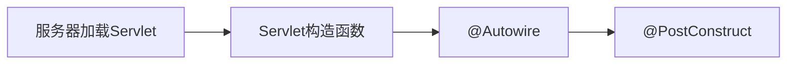

## 华资一面

—— 人力面（挂）

### 1. Spring

#### 1.1 Spring 的生命周期

> 推荐学习链接：https://blog.csdn.net/shijinjins/article/details/124071095 

Spring 生命周期会经历过四个阶段，分别是实例化、属性赋值、初始化、销毁

其他的一些阶段就是通过AOP面向切面扩展来的，能够让你在实例化、初始化和销毁前后做一些逻辑。

初始化阶段，有一个特别重要的接口`BeanPostProcessor`

- `postProcessorBeforeInitialization();` // 初始化前调用
- `postProcessorAfterInitialization();` // 初始化后调用

**初始化**方式有三个

- `InitializingBean`类的`afterPropertiesSet`方法
- `@PostConstruct`注解标注的方法 // `Spring`支持javax包中的`@PostConstruct`，会在属性值注入成功后执行
- `Spring`配置文件`applicationContext.xml`的标签属性`init-method="initMethod"`

这里提醒，`@PostConstruct`是通过`Spring`的`BeanPostProcessor#postProcessBeforeInitialization(Object, String)`来完成调用的

如果是使用到了`Spring`自动注入来使用创建的`Bean`，那么如果使用反射的方式创建对象执行构造方法，先后顺序是这样的：

反射的方式会在执行构造器后返回，所以你要通过反射使用`Bean`，可在`@PostConstruct`注解的方法保存该`Bean`，再去调用使用。

**销毁**方式有三个

- `@PreDestroy`注解标注的方法 //  // `Spring`支持javax包中的`@preDestroy`，会在销毁前执行
- `DisposableBean`接口的`destroy`方法
- `Spring`配置文件`applicationContext.xml`的标签属性`destroy-method=;"destroyMethod"`

这里提醒，`@preDestroy`执行是通过`Spring`的`DestructionAwareBeanPostProcessor#postProcessBeforeDestruction(Object, String)`来完成调用的

>  简要步骤

1.当程序加载运行时会根据spring中配置文件找到bean配置的属性和方法，并通过java反射机制创建实例化bean对象。

Bean实现了`BeanNameAware`接口，执行了`setBeanName`方法，实现注入对象。

2.实现了`BeanFactoryAware`工厂接口（延迟加载），执行了`setBeanFactory`方法。

3.实现了`ApplicationContext`接口类（立即加载），执行了`setApplicationContext`方法。

4.实现了`BeanPostProcessor`接口类，执行`postProcessBeforeInitialization`方法

5.实现了`InitiliazingBean` 执行`afterPropertiesSet`方法，并加载配置文件定义了`init-method` 则执行对应初始化方法，接着`BeanPostProcessor` 完成收尾工作 执行`postProcessorfterInitilization`方法，完成  `Bean`的初始化，使得`bean`可以使用。

6.实现了`DisposabileBean`接口执行`destroy`方法，加载配置文件中的`destroy-method`方法销毁`bean`对象实例。

#### 1.2 Spring 作用域

单例（默认`Single`）和多例（`Prototype`）

单例在一个容器里面只存在一个对象，多例的Bean生命周期在容器产生时并不创建，对象使用时才创建，最后由JVM垃圾回收器回收

生命周期出生和销毁还可以自己指定，比如

- init-method：对象出生之后立刻执行什么方法
- destroy-method：对象销毁之前执行什么方法

#### 1.3 Spring 依赖注入方式

有三种：属性注入、构造函数注入、工厂方法（通过标签属性配置静态或实例工厂）注入

而基于这三种方式有多种实现：配置文件实现、注解实现、

### 2. 集合

集合的性质: **唯一性**、**无序性**、**确定性**

唯一性指的是集合元素是不重复的、无序性指的是集合插入元素的顺序性、确定性是指集合中元素是确定的，不是相对性的。

集合类型按类型划分可以划分为可重复集合不可重复集

- 可重复集合：`List`实现类
- 不可重复集合：`Set`实现类、`Map`实现类（`key`）

按照有序性（添加和访问）划分可以划分为有序集和无序集

- 有序集：`List`实现类、`TreeSet`、`LinkedHashSet`、`LinkedHashMap`、`TreeMap`
- 无序集：`HashSet`、`HashMap`、

按照结构划分可以划分为列表`List`、`Set`、`Map`（`Stack` 和 `Queue`）

List：`ArrayList`、`LinkedList`

Set：`HashSet`、`LinkedHashSet`、`TreeSet`

Map：`HashMap`、`HashTable`、`TreeMap`、`LinkedHashMap`、`CurrentHashMap`、

按照存储连续性划分可以划分为连续集和散列集

- 连续集：`ArrayList`
- 散列集：`LinkedList`、`Map`实现类、`Set`实现类

### 3. 线程安全

#### 3.1 线程安全的集合有哪些？

HashTable、CurrentHashMap、CurrentLinkedQueue、ArrayBlockingQueue、LinkedBlockingQueue

HashTable：它的方法都使用了重量级锁synchronized修饰来保证方法执行的线程安全。

CurrentHashMap：有JDK迭代版本；

- 7使用了分段锁Segment（继承可重入锁ReentrantLock）实现线程安全，是真正意义上实现了并发
- 8使用了synchronized + CAS，因为在1.6版本之后，synchronized一步步得到优化
  - 包含了偏向锁、轻量级锁、重量级锁
  - 处于偏向锁的对象，是指可以在获得该偏向锁的同一个线程中，多次执行同步代码块时相当于无锁
  - 而如果处于偏向锁的对象被其他线程获取了，偏向锁将不再偏向，就升级为轻量级锁
  - 升级为轻量级锁还是有机会继续偏向锁的，是怎么个原理？
  - 在对象头前8个字节中，存储了偏向线程id，前提得是该线程未获取锁对象，获取锁对象后设置的是当前线程id
  - 所以想让对象头上的偏向线程id重新偏向为当前线程id，得让该线程重复获取锁对象达到阈值20次才会偏向，不过只能偏向一次
  - 这就是锁降级，如果有第三个线程参与了，同样执行第二个线程的操作，将不再偏向（对象头偏向线程id重置为0）
  - 这是由再次升级为轻量级锁，前面是不发生竞争，如果多个线程发生竞争，竞争失败会自旋CAS再次尝试获取锁，如果还是失败
  - 这时升级为重量级锁，重量级锁将不再通过乐观锁CAS操作，而是会发生阻塞，必须等获得锁的线程释放锁才能让给下一个线程

CurrentLinkedQueue：使用了非阻塞的方式实现了线程安全，是一个无锁化的单向队列，使用到了`CAS` + `for(;;)`，而且这种单向队列巧妙利用节点的不可重用 + CAS + next 指向本身 + GC垃圾回收，规避掉了ABA问题

- 因为节点出队列并不会马上出队列，而是通过next指向自己让GC垃圾回收掉，这样有线程刻意去ABA操作时，发现还有旧值，没法做修改达到ABA的目的，这说专业点就是延迟出队。

LinkedBlockingQueue：与CurrentLinkedQueue非常像，也是一个无界队列，这样如果入队快于出队的情况容易出现栈溢出

ArrayBlockingQueue：是有界队列

### 4. 谈谈自己的项目

略